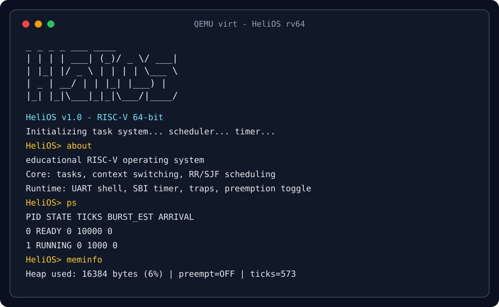

# HeliOS

HeliOS is a small educational operating-system kernel for RISC-V 64. It boots
on QEMU, opens an interactive UART shell, schedules tasks, handles timer
interrupts, and implements basic synchronization and heap allocation.

The project is intentionally compact: the goal is to make core OS mechanisms
visible without hiding them behind a large codebase.

[](https://riscv.org/)
[](https://www.qemu.org/)
[](LICENSE)
[](https://github.com/Thom-320/HeliOS/actions/workflows/build.yml)
[](scripts/smoke.sh)

<p align="center">
  
</p>

## What It Implements

- RISC-V 64 `rv64gc` kernel running on QEMU `virt` with OpenSBI.
- Interactive UART shell with process, scheduler, memory, and timer commands.
- Cooperative and preemptive Round-Robin scheduling.
- Shortest Job First scheduling with burst estimates.
- Task creation, context switching, and simple process inspection.
- SBI timer interrupts at 100 Hz.
- Semaphores, mutexes, and a producer-consumer demo.
- Free-list heap allocator with block coalescing.
- Automated QEMU smoke test for CI.

## Why It Matters

HeliOS is not a toy shell wrapped around QEMU output. It exercises the pieces
that make an operating-system kernel interesting: boot code, traps, task state,
scheduling policy, synchronization, memory management, and repeatable runtime
checks. The code is small enough to inspect, but complete enough to demonstrate
real systems behavior.

## Quickstart

Install the required toolchain:

```bash
# macOS
brew install qemu riscv-gnu-toolchain

# Ubuntu/Debian
sudo apt-get install qemu-system-misc gcc-riscv64-unknown-elf
```

Build and run:

```bash
make clean && make -j
make run
```

Try these commands at the `HeliOS>` prompt:

```text
about
help
ps
run cpu
run io
ps
sched preempt on
uptime
meminfo
intstats
```

Exit QEMU with `Ctrl+C`.

## Automated Demo

```bash
./scripts/demo.sh
```

The demo sends a short command sequence to the shell: `about`, `help`, `ps`,
`run cpu`, `run io`, `ps`, `sched rr`, and `meminfo`.

## Shell Commands

| Command | Purpose |
| --- | --- |
| `about` | Show kernel capabilities |
| `help` | List shell commands |
| `ps` | List active tasks |
| `run cpu` | Create a CPU-bound task |
| `run io` | Create an I/O-bound task |
| `kill <pid>` | Terminate a task |
| `sched rr` | Switch to Round-Robin scheduling |
| `sched sjf` | Switch to Shortest Job First scheduling |
| `sched preempt on|off` | Enable or disable timer preemption |
| `sleep <ticks>` | Sleep for a number of timer ticks |
| `pcdemo` | Run the producer-consumer synchronization demo |
| `bench` | Run a scheduler benchmark |
| `uptime` | Show runtime in ticks and seconds |
| `meminfo` | Show heap usage |
| `intstats` | Show timer and interrupt state |

## Repository Layout

```text
boot/start.S          Boot entry and context switch
kernel/               Kernel entrypoint, shell, scheduler, tasks, traps, heap
drivers/              UART and SBI timer drivers
lib/printf.c          Minimal formatted output
include/helios.h      Shared kernel declarations
scripts/              QEMU, demo, and smoke-test helpers
docs/                 Technical notes and visualization
```

## Make Targets

```bash
make            # Build the kernel
make run        # Run in QEMU
make run-gdb    # Run QEMU with a GDB server
make gdb        # Connect GDB
make smoke      # Build and run the QEMU smoke test
make clean      # Remove build artifacts
make dtb        # Extract the QEMU device tree
```

## Verification

```bash
make smoke
```

The smoke test boots the kernel, drives the shell, and checks for expected
output from `about`, `help`, `ps`, `uptime`, `meminfo`, and `intstats`.

## Current Limits

- No MMU: memory is physical and direct.
- No filesystem: runtime state lives in memory.
- Single supervisor-mode environment: no strict user/kernel separation.

## Documentation

- [Quick reference](README_RAPIDO.md)
- [Technical documentation](docs/README.md)
- [Web visualization](docs/visualization.html)

## License

MIT. See [LICENSE](LICENSE).
